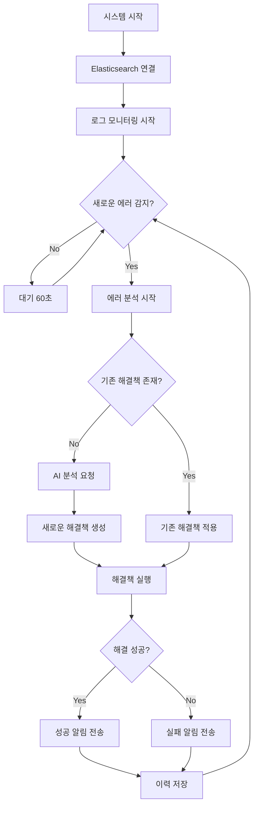
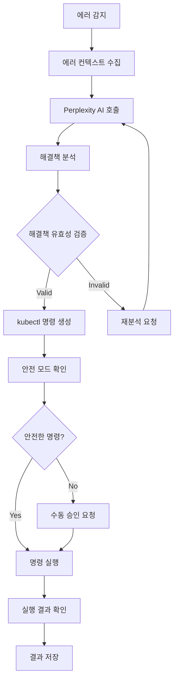

# ELK Auto Resolver

AI 기반 자동 에러 탐지 및 해결 시스템

## 개요

ELK Auto Resolver는 ELK Stack (Elasticsearch, Logstash, Kibana)과 연동하여 실시간으로 시스템 에러를 감지하고, AI를 활용해 자동으로 문제를 해결하는 지능형 시스템입니다.

## 시스템 아키텍처
```
elk-auto-resolver-architecture.png
```

## 데이터 플로우

```
📊 로그 수집 → 🔍 에러 감지 → 🧠 해결책 결정 → ⚡ 자동 해결 → 📱 알림
```

**1. 로그 수집 단계**
```
Kubernetes Pods → Filebeat → Logstash → Elasticsearch
```

**2. 에러 감지 단계**
```
Error Monitor → Elasticsearch Query → 에러 패턴 매칭 → 임계값 확인
```

**3. AI 분석 단계**
```
감지된 에러 → PostgreSQL 조회 → 기존 해결책 확인 (success_rate > 50%)
     ↓                                        ↓
     └─── 없음 ────→ 🤖 Perplexity AI API → 해결책 생성 → PostgreSQL 저장
     └─── 있음 ────→ 📚 기존 해결책 재사용 (API 비용 0원!)
```

**4. 자동 해결 단계**
```
AI 해결책 → kubectl 명령 생성 → Kubernetes 실행 → 결과 확인
```

**5. 알림 단계**
```
처리 결과 → Slack Webhook → 실시간 알림 → 사용자 확인
```

**6. 학습 단계 ⭐ 지속적 개선**
```
실행 결과 → PostgreSQL 업데이트 → 성공률 계산 → 다음 에러 시 활용
```

## 주요 기능

### 🔍 **실시간 에러 감지**
- Elasticsearch에서 실시간 로그 모니터링
- 다양한 에러 패턴 인식 및 분류
- 임계값 기반 알림 시스템

### 🤖 **AI 기반 자동 해결**
- Perplexity AI를 활용한 지능형 에러 분석
- 과거 해결책 학습 및 재사용
- Kubernetes 환경에서 자동 복구 실행

### 📊 **포괄적인 모니터링**
- 시스템 상태 실시간 추적
- PostgreSQL 기반 이력 관리
- 성능 메트릭 및 통계 제공

### 🔔 **실시간 알림**
- Slack 통합 알림 시스템
- 에러 감지, 해결 성공/실패 알림
- 커스터마이징 가능한 알림 설정

### 🗂️ **자동 로그 관리**
- 시간 기반 로그 정리
- 디스크 공간 최적화
- 설정 가능한 보존 정책

## 워크플로우

### 🔄 **기본 모니터링 워크플로우**



### 🤖 **AI 분석 워크플로우**



## 빠른 시작

⚠️ **설치 전 필수 확인사항**: [선수조건 가이드](docs/PREREQUISITES.md) 참고

### GitHub에서 직접 설치 (권장)

```bash
# ✅ 선수조건: ELK Stack 설치 + API 키 준비 완료 후 진행

# 1. GitHub에서 프로젝트 클론
git clone https://github.com/howjinpark/k8s-ELK-Auto-Resolver.git
cd k8s-ELK-Auto-Resolver

# 2. 자동 설치 실행
chmod +x scripts/install.sh
./scripts/install.sh

# 3. API 키 설정 (사용자가 직접 입력)
nano config/.env
# PERPLEXITY_API_KEY=your_actual_api_key
# SLACK_WEBHOOK_URL=your_actual_webhook_url
# ELASTICSEARCH_PASSWORD=your_es_password

# 4. 실행
./scripts/run.sh
```

### ZIP 파일로 다운로드

```bash
# ZIP 다운로드 방식
wget https://github.com/howjinpark/k8s-ELK-Auto-Resolver/archive/main.zip
unzip main.zip
cd k8s-ELK-Auto-Resolver-main
chmod +x scripts/install.sh
./scripts/install.sh
```

### 수동 설치

자세한 수동 설치 방법은 [배포 가이드](docs/DEPLOYMENT_GUIDE.md)를 참고하세요.

## 설정

### 필수 환경 변수

```bash
# config/.env 파일에 설정
PERPLEXITY_API_KEY=your_api_key
SLACK_WEBHOOK_URL=your_webhook_url
DATABASE_PASSWORD=your_db_password
ELASTICSEARCH_PASSWORD=your_es_password
```

### 주요 설정 옵션

```yaml
# config/config.yaml
monitoring:
  check_interval: 60        # 체크 간격 (초)
  error_threshold: 25       # 알림 임계값

log_management:
  cleanup_interval_hours: 24  # 정리 간격
  retention_days: 7          # 보존 기간

resolver:
  safe_mode: true           # 안전 모드
  max_retries: 3           # 최대 재시도
```

## 사용법

### 기본 실행

```bash
# 간단한 실행 (권장)
./scripts/run.sh

# 백그라운드 실행
./scripts/run-background.sh

# 수동 실행 (가상환경 직접 활성화)
source venv/bin/activate
python3 scripts/start_resolver.py
```

### 서비스로 실행

```bash
# 서비스 등록 및 실행
sudo systemctl enable elk-auto-resolver
sudo systemctl start elk-auto-resolver

# 상태 확인
sudo systemctl status elk-auto-resolver

# 로그 확인
journalctl -u elk-auto-resolver -f
```

## 문서

- **설치 가이드**
  - [선수조건 가이드](docs/PREREQUISITES.md) - ⚠️ **설치 전 필수 확인사항**
  - [GitHub 설치 가이드](docs/GITHUB_INSTALL_GUIDE.md) - 🚀 **가장 쉬운 설치 방법**
  - [배포 가이드](docs/DEPLOYMENT_GUIDE.md) - 상세 수동 설치 방법
  
- **사용 및 관리**
  - [로그 관리 가이드](docs/LOG_MANAGEMENT_GUIDE.md) - 로그 정리 및 관리
  - [사용법 가이드](docs/ELK-STACK-USAGE-GUIDE.md) - 기본 사용법
  
- **시스템 정보**
  - [아키텍처 문서](docs/ELK-STACK-FINAL-ARCHITECTURE.md) - 시스템 구조
  - [트러블슈팅](docs/ELK-STACK-TROUBLESHOOTING-GUIDE.md) - 문제 해결

---

**ELK Auto Resolver** - 지능형 시스템 모니터링의 새로운 표준
